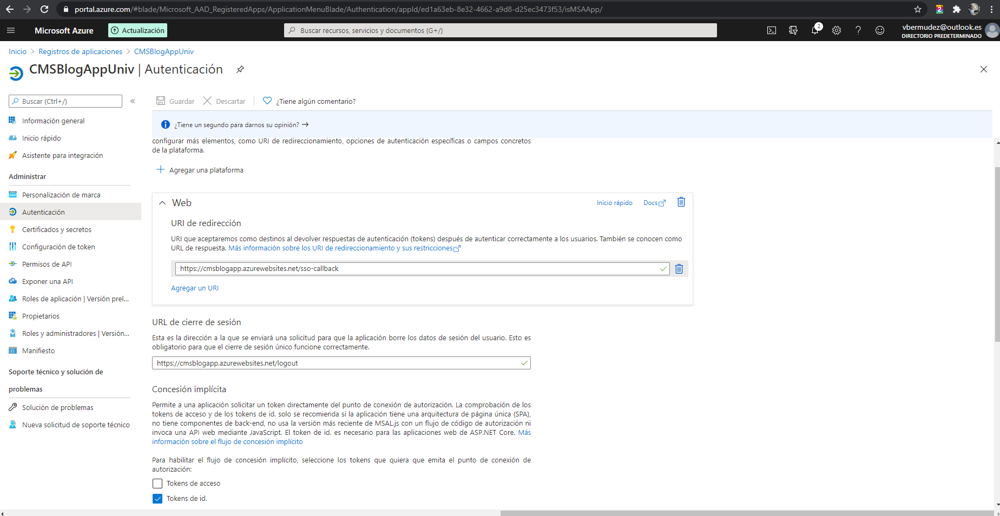

# Write-up

> Article CMS App URL: [https://cmsblogapp.azurewebsites.net](https://cmsblogapp.azurewebsites.net/)

> The code can be accessed on [https://github.com/vbermudez/nd081-c1-provisioning-microsoft-azure-vms-project-starter](https://github.com/vbermudez/nd081-c1-provisioning-microsoft-azure-vms-project-starter)

> All screenshots are uploaded on [https://github.com/vbermudez/nd081-c1-provisioning-microsoft-azure-vms-project-starter/tree/master/scr_captures](https://github.com/vbermudez/nd081-c1-provisioning-microsoft-azure-vms-project-starter/tree/master/scr_captures)

## Table of Contents

- [Write-up](#write-up)
  - [Table of Contents](#table-of-contents)
  - [Justification](#justification)
    - [Analyze, choose, and justify the appropriate resource option for deploying the app.](#analyze-choose-and-justify-the-appropriate-resource-option-for-deploying-the-app)
    - [Assess app changes that would change your decision.](#assess-app-changes-that-would-change-your-decision)
  - [Screen captures](#screen-captures)
    - [Articles list](#articles-list)
    - [Edit Article](#edit-article)
    - [Resource Group](#resource-group)
    - [Database Datail](#database-datail)
    - [Storage Account Setting](#storage-account-setting)
    - [App Registration](#app-registration)
    - [Login attempts log](#login-attempts-log)

## Justification

### Analyze, choose, and justify the appropriate resource option for deploying the app.

*For **both** a VM or App Service solution for the CMS app:*
- *Analyze costs, scalability, availability, and workflow*
- *Choose the appropriate solution (VM or App Service) for deploying the app*
- *Justify your choice*

I think that Azure App Services is right choice for to deploy this kind of web applications. Not only because it is a managed service, with real time logs, monitoring and quick and easy administration interface though Azure Portal; but also because the workflow (via command `az webapp` or GitHub integration) is really simple, scalabilty and availability is out-of-the-box, it provides better SLA than VMs and costs can be as lower as a third part of the costs running in a VM. 

### Assess app changes that would change your decision.

*Detail how the app and any other needs would have to change for you to change your decision in the last section.* 

I think that the app requirements need to change dramatically. Even to the point to become not a "Blog" or "Forum" like application, but becoming a full Content Manager like IBM FileNet. While it only manages som titles, authors, texts and simple images; I will allways choose Azure App Services.
In the mentioned case, I would choose a VM deploy, because it surely need that kind of resources, not to mention some enterprise integration solutions.

## Screen captures

### Articles list

### Edit Article

### Resource Group

### Database Datail

### Storage Account Setting

### App Registration

### Login attempts log

